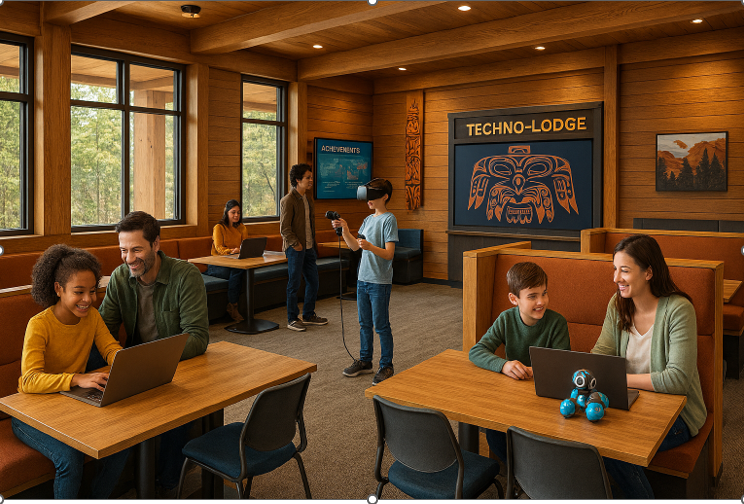
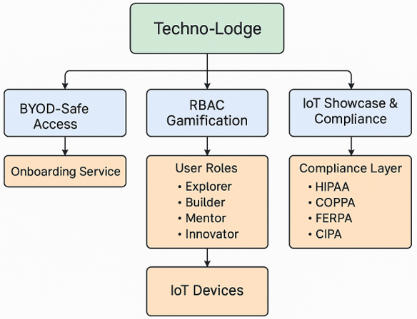
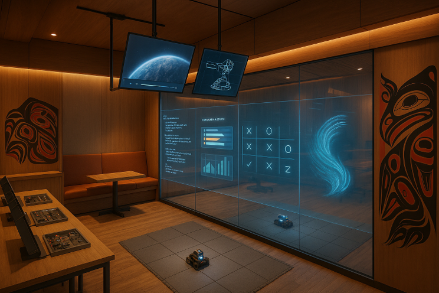

# Techno-Lodge: Where Creativity Meets Cyber Confidence

Welcome to **Techno-Lodge**, a youth-driven, community-wide hub for technology, culture, and learning. This project adapts proven IoT security principles to create a **privacy-first, inclusive, and scalable platform** for engagement.

---

## Clickable Index
- [Techno-Lodge: Where Creativity Meets Cyber Confidence](#techno-lodge-where-creativity-meets-cyber-confidence)
  - [Clickable Index](#clickable-index)
  - [Vision:](#vision)
  - [Mission:](#mission)
  - [Core Features](#core-features)
  - [BYOD-Safe Access](#byod-safe-access)
  - [RBAC Gamification](#rbac-gamification)
  - [IoT Showcase \& Compliance](#iot-showcase--compliance)
  - [Stakeholder Benefits](#stakeholder-benefits)
  - [Why This Matters](#why-this-matters)
    - [Cultural Design Disclaimer](#cultural-design-disclaimer)
  - [What This API Offers](#what-this-api-offers)
  - [Roadmap](#roadmap)

## Vision: 
Create a ski-lodge-inspired tech and culture space blending VR entertainment, cybersecurity skill-building, and social engagement for youth and all demographics.


 
## Mission: 
Provide a structured, inclusive, and interactive venue where young people gain digital literacy, leadership experience, and creative confidence—while enjoying immersive tech and cultural experiences.

“Techno-Lodge isn’t just a tech hub—it’s a platform for curiosity, civic engagement, and leadership development, built on secure and scalable technology.”

“Cybersecurity and IoT aren’t the end goals—they’re the foundation that makes inclusive, safe, and future-facing community spaces possible.”

“This concept is designed in gratitude with the hope of inspiring young people to explore technology while embracing civic principles.”

“Every feature—from BYOD-safe access to RBAC gamification—was chosen to balance innovation with trust, privacy, and inclusivity.”

---

## Core Features
- **Lodge-Style Design:** Warm, inviting architecture with social lounges.
- **VR & AR Zones:** Gamified learning and entertainment experiences.
- **Cybersecurity Labs:** Ethical hacking challenges in isolated networks.
- **Internship Program:** Youth-led stewardship for operations and mentoring.
- **Music & Culture:** Live performances, art installations, and themed events.
- **Food & Social Spaces:** Multiple vendors and community gathering areas.
- **Family Inclusion:** Open to all ages for shared experiences and intergenerational learning.



---

## BYOD-Safe Access
Empower participants to bring their own devices with:
- Secure onboarding using QR codes and encrypted channels.
- Privacy-first design inspired by healthcare-grade standards.
- Age-based consent workflows for minors (COPPA compliance).
- Positive framing: “Your device, your experience—safe and secure.”

---

## RBAC Gamification
Roles earned through contribution, not restriction:
- **Explorer:** Basic access to VR zones and social spaces.
- **Builder:** Contribute ideas or help with events → unlock advanced tech labs.
- **Mentor:** Lead workshops or projects → gain admin privileges.
- **Innovator:** Showcase IoT solutions and mentor others.

Progression unlocks internships, leadership badges, and community prestige.

---



## IoT Showcase & Compliance
Our IoT layer demonstrates best practices in security and privacy:
- HIPAA-inspired encryption and consent-driven analytics.
- COPPA, FERPA, and CIPA principles integrated for youth safety.
- Device testing sandbox: Students can try IoT devices before families invest.
- Positive framing: “Innovation with confidence—privacy built in.”

---

## Stakeholder Benefits
- **Education:** Internships, hands-on learning, career pathways.
- **Government:** Aligns with STEM goals and workforce development.
- **Youth Organizations:** Structured after-school engagement and mentorship.
- **Industry:** Talent pipeline and innovation showcase.
- **Families:** Inclusive experiences and digital literacy for all ages.

---

## Why This Matters
Employers increasingly seek professionals who combine technical expertise with adaptability, empathy, and resilience. Techno-Lodge creates a talent pipeline that meets industry needs while shaping individuals who contribute positively to society.Techno-Lodge is more than a technical prototype—it’s a vision for community empowerment. By combining cybersecurity principles with inclusive design, we create a space where technology serves humanity:
- Inspiring curiosity and civic engagement in young people.
- Building pathways to industry readiness through internships and mentorship.
- Revitalizing underutilized spaces for economic and social impact.

### Cultural Design Disclaimer

Any Indigenous art or cultural elements in this initiative will only be used with explicit permission from the relevant Tribes and artists. The current visuals are conceptual and do not include authentic tribal designs. Before incorporating cultural motifs in production assets or spaces, the project will:

- Conduct government-to-government consultation with the appropriate Tribes.
- Obtain Free, Prior, and Informed Consent (FPIC).
- Commission Indigenous artists and cultural advisors for authentic representation.
- Provide interpretive context for any cultural elements included.

These steps ensure respect, authenticity, and alignment with cultural protocols.

---

## What This API Offers
The included **FastAPI-based script** demonstrates:
- **BYOD Onboarding:** Age-based consent and secure device registration.
- **RBAC Role Management:** Gamified progression from Explorer to Innovator.
- **Compliance Validation:** Built-in checks for HIPAA, COPPA, FERPA, and CIPA.
- **IoT Integration:** Ready for real-time monitoring and device testing.
- **Scalability:** Modular design for future VR/AR and internship features.

Run it locally and explore interactive docs at `/docs` after starting the server:
```bash
uvicorn techno_lodge_api:app --reload
```

---

## Roadmap
See ROADAP.md for development phases.